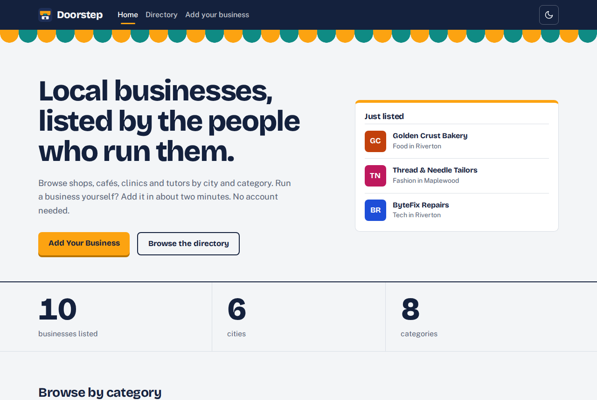
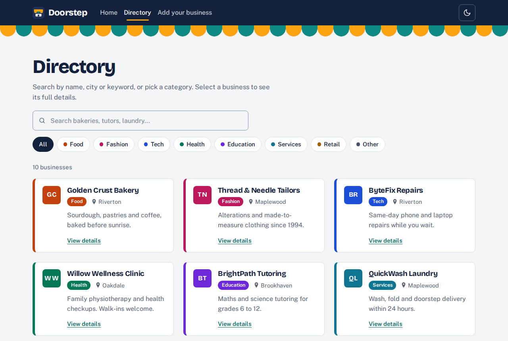
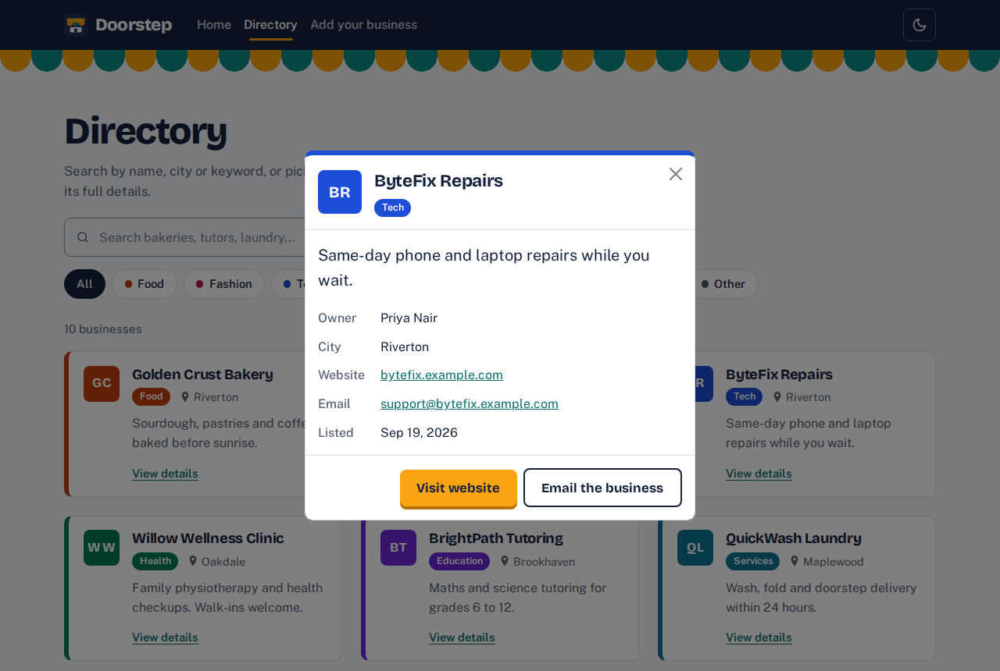
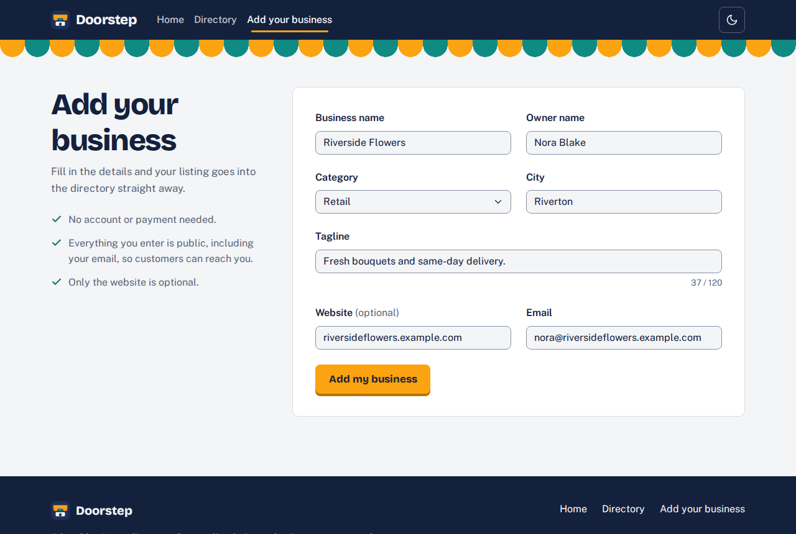
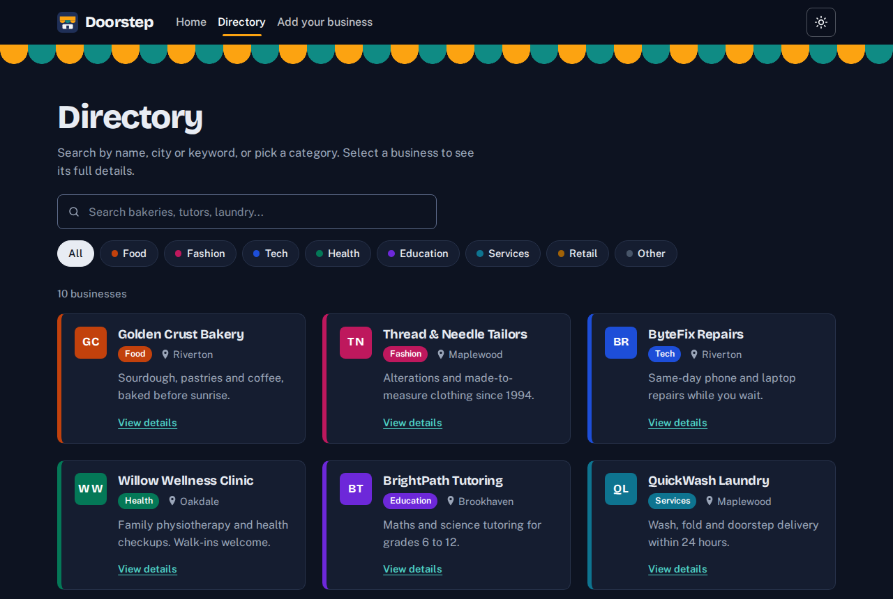
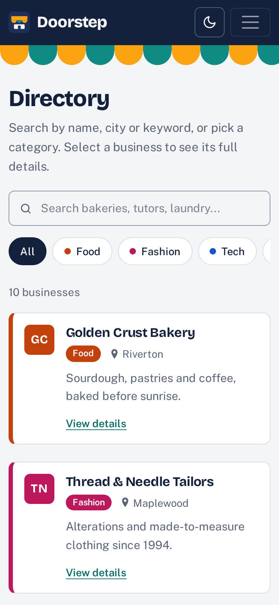

# Doorstep: Local Business Directory

A small website that lists local businesses and lets an owner submit their own.
The frontend is plain HTML, CSS and JavaScript with jQuery and Bootstrap (loaded from a CDN),
with no framework and no build step. The backend is a Node + Express + MongoDB API.

## Live links

| What | Link |
| --- | --- |
| Website (Netlify) | https://YOUR-SITE.netlify.app |
| API (Render) | https://YOUR-API-NAME.onrender.com |
| Repository | https://github.com/YOUR-USERNAME/business-directory |

> Replace the three links above once you have deployed. The Render free tier sleeps after
> 15 minutes, so the first request can take 30 to 50 seconds. The site shows a
> "server is waking up" message while it waits.

## Screenshots

> These were taken from a local test run. Replace them with screenshots of your live site
> (same file names, in `docs/screenshots/`).

| Home | Directory |
| --- | --- |
|  |  |

| Details modal | Submit form |
| --- | --- |
|  |  |

| Dark mode | Phone screen |
| --- | --- |
|  |  |

## Features

**Home**
- Hero with a headline, a short description and an **Add Your Business** button
- Three counters (businesses, cities, categories) that count up from the API
- A "Just listed" board with the three newest businesses
- Quick links to browse by category

**Directory**
- Bootstrap card grid loaded from the API, newest first
- Search box (jQuery `keyup`, with a short pause before it asks the server)
- Category filter chips; search and filter also work together and are kept in the URL
  (`directory.html?q=bakery&category=Food`)
- Click a card to open a Bootstrap modal with the full details
- Loading placeholders, an empty state, and a friendly error with a **Try again** button

**Submit**
- Bootstrap form: business name, owner name, category, city, tagline, website, email
- jQuery validation (on blur, on input while fixing, and on submit)
- POSTs JSON to the API; if the API answers `400` with a `fields` object, each message is shown under its input
- Success message with a link straight to the new listing

**Every page**
- Navbar and footer, skip link, keyboard-friendly focus styles
- Dark mode toggle that remembers the choice (`localStorage`) and follows the system setting on the first visit
- Own design on top of Bootstrap: navy, marigold and teal palette, Bricolage Grotesque + Public Sans fonts
- Works on a phone screen (375px and up)

## Tech stack

HTML, CSS, JavaScript, jQuery 3.7, Bootstrap 5.3 (CDN) | Node.js, Express, Mongoose | MongoDB Atlas | Git and GitHub | Netlify (frontend) and Render (API)

## Project structure

```
business-directory/
├── client/                    Frontend (published to Netlify as-is)
│   ├── index.html             Home page
│   ├── directory.html         Directory page (cards, search, filter, modal)
│   ├── submit.html            Submit form
│   ├── css/
│   │   └── style.css          Our styles on top of Bootstrap (tokens, navbar, cards, dark mode)
│   ├── js/
│   │   ├── config.js          The API address. Edit this after deploying the API.
│   │   ├── common.js          Shared: dark mode, API helper, small utilities
│   │   ├── home.js            Count-up counters and the "Just listed" board
│   │   ├── directory.js       Load, search, filter and modal
│   │   └── submit.js          Validation, POST and success message
│   └── img/
│       └── favicon.svg
├── server/                    Backend API (deployed to Render)
│   ├── server.js              Connects to MongoDB and starts the server
│   ├── app.js                 Express app: CORS, JSON, routes, error handling
│   ├── routes/
│   │   └── businesses.js      GET /api/businesses, GET /api/businesses/stats, POST /api/businesses
│   ├── models/
│   │   └── Business.js        Mongoose schema and validation rules
│   ├── seed.js                Loads 10 sample businesses (npm run seed)
│   ├── package.json
│   ├── .env.example           Copy to .env and add your MongoDB connection string
│   └── README.md              Server-only notes
├── docs/
│   └── screenshots/           Images used in this README
├── dev.js                     `npm start` runs the API and serves the website together
├── package.json               Root scripts: start, dev, seed
├── netlify.toml               Tells Netlify to publish the client/ folder
├── .gitignore                 Keeps .env and node_modules out of Git
└── README.md
```

## Run it locally

You need [Node.js](https://nodejs.org) 18 or newer and a free [MongoDB Atlas](https://www.mongodb.com/atlas) account.

### 1. Create the database (once)

1. In Atlas, create a free **M0** cluster.
2. **Database Access** > add a database user (username and password).
3. **Network Access** > add IP address `0.0.0.0/0` (allow from anywhere). Render's free tier has no fixed IP, so this is needed for the deployed API too.
4. **Connect** > **Drivers** > copy the connection string.

### 2. Add your connection string (once)

```bash
cd server
copy .env.example .env      # macOS/Linux: cp .env.example .env
```

Open `server/.env` and paste your connection string into `MONGODB_URI`.
Replace `<user>` and `<password>` and keep `/business-directory` before the `?`.
If the password has special characters (`@`, `#`, `/`), URL-encode them.
Then go back to the project root: `cd ..`

### 3. Start everything with one command

From the **project root** (the folder that contains `client` and `server`):

```bash
npm run seed     # once: loads 10 sample businesses (skips if the database already has data)
npm start        # API on http://localhost:5000 and website on http://localhost:8080
```

The first `npm start` installs the server's packages for you. Press `Ctrl+C` to stop both.
Open http://localhost:8080. When the page is opened from `localhost`, it talks to `http://localhost:5000`
automatically, so `config.js` needs no change while you develop.

If Atlas fails with `querySrv ECONNREFUSED`, that is a DNS problem on your network.
Uncomment `DNS_SERVERS=8.8.8.8,1.1.1.1` in `server/.env` and try again.

**Prefer two terminals?** `cd server && npm start` for the API, and `npx serve client -l 8080` for the website.

## API

Base URL: your Render URL (or `http://localhost:5000` locally).

| Route | What it does |
| --- | --- |
| `GET /api/businesses` | All businesses, newest first. `?q=bakery` searches name, tagline, city and category. `?category=Food` filters. Both can be combined. |
| `GET /api/businesses/stats` | `{ "total": 10, "cities": 6, "categories": 8 }` |
| `POST /api/businesses` | Send the form as JSON. Returns `201` and the saved business. |

Categories: `Food`, `Fashion`, `Tech`, `Health`, `Education`, `Services`, `Retail`, `Other`.

A business looks like this:

```json
{
  "_id": "665f1c...",
  "name": "Golden Crust Bakery",
  "owner": "Amelia Hart",
  "category": "Food",
  "city": "Riverton",
  "tagline": "Sourdough, pastries and coffee, baked before sunrise.",
  "website": "https://goldencrust.example.com",
  "email": "hello@goldencrust.example.com",
  "createdAt": "2026-09-19T08:00:00.000Z"
}
```

When the data is not valid, `POST` answers `400` and names each problem, so the page can show it under the right input:

```json
{
  "message": "Please fix the highlighted fields.",
  "fields": { "name": "Enter the business name.", "email": "Enter a valid email address." }
}
```

`website` is the only optional field. A bare `example.com` is saved as `https://example.com`.
Each visitor can submit up to 20 businesses per hour.

## Deploy

Deploy in this order: database, API, frontend.

### 1. MongoDB Atlas
Already done in "Run it locally". Run `npm run seed` once with your `.env` pointing at Atlas.

### 2. API on Render

1. Push the project to GitHub (see below).
2. On [render.com](https://render.com): **New** > **Web Service** > connect the `business-directory` repo.
3. Use these settings:

   | Setting | Value |
   | --- | --- |
   | Root Directory | `server` |
   | Runtime | Node |
   | Build Command | `npm install` |
   | Start Command | `npm start` |
   | Instance type | Free |
   | Environment variable | `MONGODB_URI` = your Atlas connection string |

4. When the deploy finishes, open the Render URL. You should see `{"status":"ok", ...}`. Then open `/api/businesses`.

### 3. Frontend on Netlify

1. Open `client/js/config.js` and set `API_URL` to your Render URL (no trailing slash). Commit and push.
2. On [netlify.com](https://www.netlify.com): **Add new site** > **Import an existing project** > pick the repo.
3. Publish directory: `client`. Build command: leave empty. (`netlify.toml` already says this.)
4. Netlify redeploys on every push.

Optional: once the site is live, set `CORS_ORIGIN` on Render to your Netlify URL so only your site can call the API.

## Git and GitHub

```bash
git init
git add .
git status                  # check that .env is NOT listed
git commit -m "Add client and server starter"
git branch -M main
git remote add origin https://github.com/YOUR-USERNAME/business-directory.git
git push -u origin main
```

Commit after every feature that works, with a message that says what you did, for example:
`add navbar and footer`, `add home counters`, `add search bar`, `add category filter`, `add details modal`, `add submit form validation`, `fix mobile navbar`, `add dark mode toggle`.
Push at the end of each day at minimum. `.env` is already in `.gitignore`. Never commit it.

## How the frontend fits together

- Every page loads Bootstrap, jQuery, then `config.js` and `common.js`, then its own script.
- `common.js` exposes `window.Doorstep`: the category list, an `esc()` function that makes text safe to put in HTML, and `Doorstep.api.get/post`, which adds the API address, a 90 second timeout and the "server is waking up" callback.
- All text from the API is escaped before it is shown, and website links are only used when they start with `http` or `https`.
- Dark mode uses Bootstrap's `data-bs-theme` attribute. A tiny script in each page's `<head>` sets it before the page paints, so there is no flash.
- Colours, fonts and spacing are CSS variables at the top of `css/style.css`. Change them there to re-theme the whole site.

## Done when

- [ ] Submitting a business on the live site makes it appear on the live directory
- [ ] Every page works on a phone screen, in light and dark mode, with no errors in the browser console
- [ ] This README has both live URLs and screenshots

## Troubleshooting

| Problem | Fix |
| --- | --- |
| The page says "The API address isn't set yet" | On your computer, open the site at `http://localhost:8080` (or a `192.168.x.x` address) with `npm start` running. On the live site, put your Render URL in `client/js/config.js`, commit and push. |
| The first load takes about a minute | Normal on Render's free tier. The API was asleep. |
| `MongoDB connection failed` | Check the password, that `<user>` and `<password>` were replaced, and that Atlas Network Access allows `0.0.0.0/0`. |
| Browser console shows a CORS error | If you set `CORS_ORIGIN` on Render, it must match your Netlify URL exactly (with `https://`, no trailing slash). |
| The directory is empty | Run `npm run seed` in `server/` with your `.env` pointing at Atlas. |
| Changes don't show on Netlify | Push to GitHub, then check the deploy log in Netlify. |

## If you finish early

- Admin page that approves or deletes a business, protected by a secret key sent in a request header
- Logo upload with a free Cloudinary account
- Move the API into a Netlify Function with `serverless-http` so the whole project lives on one URL
